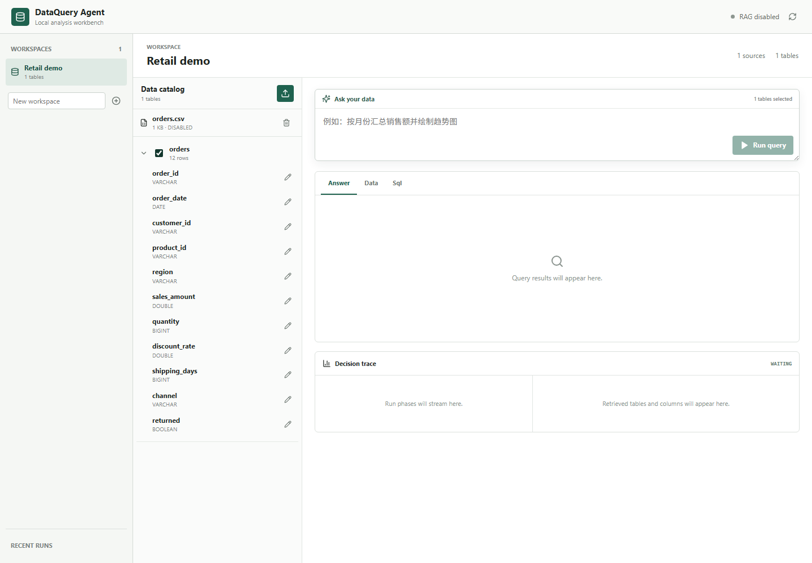
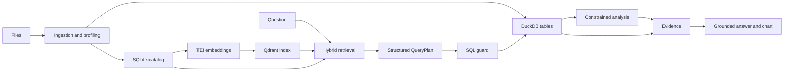

# DataQuery Agent

DataQuery Agent is a local-first workbench for asking questions of CSV, TSV, XLS, XLSX, and Parquet data.
It turns natural language into a guarded DuckDB query, optional constrained analysis, evidence-backed
answers, and ECharts visualization.

It is a substantial refactor of [didilili/shopkeeper-agent](https://github.com/didilili/shopkeeper-agent).
The exact upstream revision and MIT attribution are in [NOTICE.md](NOTICE.md).



## Architecture



RAG only locates relevant table and column semantics. DuckDB and Pandas produce facts; the LLM
plans and expresses an answer but cannot use catalog text as numerical evidence.

## Five-Minute Demo

Prerequisites: Docker Desktop with Compose. The first start downloads the embedding model to a
named Docker volume; no model file is stored in Git.

```powershell
Copy-Item .env.example .env
# Set LLM_API_KEY in .env for natural-language runs.
docker compose up --build
```

Open [http://127.0.0.1:5173](http://127.0.0.1:5173), create a workspace, upload CSV/TSV/XLS/XLSX/Parquet
files under `evaluations/data/`, and ask for sales by region or a monthly sales trend. A single
file is limited to 50 MB and a workspace to 200 MB.

| Service | Host address |
| --- | --- |
| Workbench | `127.0.0.1:5173` |
| API | `127.0.0.1:8000` |
| Qdrant | `127.0.0.1:6333` |
| TEI | `127.0.0.1:8081` |

`/health` reports process liveness. `/ready` separately reports SQLite, DuckDB, Qdrant, and TEI.
All Compose ports are loopback-only.

## Local Development

```powershell
uv sync --dev
uv run pytest -q
uv run uvicorn app.main:app --host 127.0.0.1 --port 8000
```

In another terminal:

```powershell
Set-Location frontend
pnpm install --ignore-scripts
node node_modules/typescript/bin/tsc --noEmit
node node_modules/vite/bin/vite.js --host 127.0.0.1 --port 5173
```

## Evaluation

- 50 bilingual catalog retrieval cases with Recall@5 and MRR gates.
- 40 golden query cases with guarded-plan validity, execution success, and numerical grounding gates.
- Workspace-isolation, idempotent indexing, annotation, fallback, and unsafe-SQL checks.

Run deterministic checks with `uv run pytest -q tests/test_evaluations.py tests/test_rag.py`.
With Qdrant and TEI running, `uv run python evaluations/run_retrieval_live.py` writes a fresh,
ignored live-vector report under `artifacts/`. No upstream RAG metric is inherited. See
[evaluations/README.md](evaluations/README.md) for the distinction between offline and live runs.

## Limits And Security

- Local single-user tool only: no multi-tenancy, external database connections, reconciliation
  rules, reports, or arbitrary Python execution.
- `sqlglot` accepts a single catalog-checked read-only query. DuckDB external access is disabled,
  and query/analysis/chart limits are enforced.
- RAG failure is explicit: the API and workbench show lexical fallback or indexing failure.
- Analysis requests are planned by the LLM as an allowlisted formula and intent, then computed by
  Pandas for descriptive statistics, group aggregation, correlation, trend, or IQR outliers.
- User data, `.env`, logs, caches, model files, and evaluation output are ignored by Git.

## Resume Description

Built a local-first natural-language data analysis Agent using FastAPI, LangGraph, DuckDB, SQLite,
Qdrant, TEI, React, and ECharts. Implemented workspace-scoped catalog RAG, guarded SQL execution,
constrained analysis/chart contracts, evidence-backed answers, SSE decision traces, reproducible
Docker Compose deployment, and 50 retrieval plus 40 grounded-query evaluation cases.
